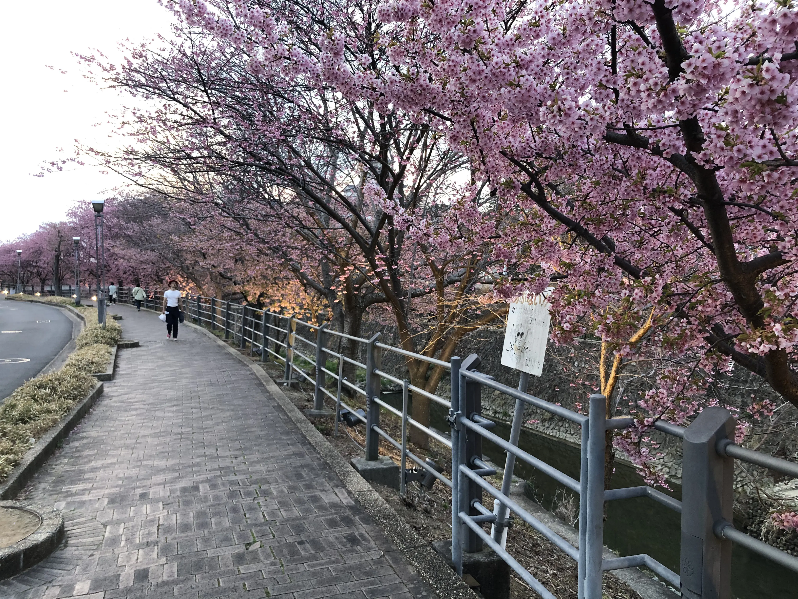

Hi 👋 and welcome to the last post of 2023!

As already done [last year](https://marcobacis.com/blog/2022-a-review/), it’s time for a end-of-year recap!

I usually spend the last days of the year eating and laying on the couch (christmas is strong in italy) so don’t expect a long post.

Let’s begin!

## 2023 Goals Review

First, a short check on the goals I wrote in my 2022 review:

**❓Learn in public**

I definitely tried to expose myself a little more and share what I learned in public. Some examples are my blog posts on books I read ([here](https://marcobacis.com/blog/atomic-habits-book/), [here](https://marcobacis.com/blog/philosophy-of-software-design/) and [here](https://marcobacis.com/blog/indistractable-book-summary/)), and the github repos for [Advent Of Code](https://github.com/marcobacis/adventofcode) and [Coding Challenges](https://github.com/marcobacis/coding-challenges).

I left a question mark because I think I could have done more this year, and there’s room for improvement.

❓ **Improve as a Backend Developer**

Another goal, another question mark. Even though I got better at working on the backend (e.g. I just read *Building Microservices* and two books on DDD) I didn’t work much with backend systems in the last months, focusing more on device communication (e.g. serial port, BLE) and GUIs (in windows) instead of web applications.

This will definitely change next year (see below for why…spoiler: in my new job I’ll work mostly on web applications 😛).

**✅ Attend more meetups and conferences**

This is a green flag! I attended a lot of conferences and meetups this year. This helped my in meeting a lot of people and technologies. I documented some of the events in this blog, so make sure to give it a look 😁

**✅ Take care of my body and mind**

The first half of the year was meh (I reached 100Kg and didn’t exercise), but it got better in the second half: I started to watch more what I eat and started exercising a bit, and right now I’m about 92Kg with a tiny bit of fat less than before 😅.

## Work

Let’s deep dive into some aspects of this year, starting with my job as a software engineer/developer/whatever.

The year started with a long-running project finally coming to an end. We finished it by testing with the customer for a last time…..in japan! I went to Okinawa for the tests, and mainland Japan for the final review of the project. In the end, the customer was satisfied by our work and I managed to visit a small japanese town (even if it was just for a day)! I also managed to see sakura trees blooming even if it was march.

From April to October I worked for [WeArt](https://weart.it/), a small startup inside e-Novia focusing on haptics for Virtual/Augmented reality. In particular, I worked on their low-level SDK (e.g. [improving the documentation](https://marcobacis.com/blog/docs-as-code-doxygen-awesome/)) and their Middleware software (a WinUI/UWP app to communicate with their device). 

In WeArt I learned to be more proactive in my work. Being in a small, product-oriented startup shifted my actions from just doing what I was told (common in consulting firms) to actively thinking on how to improve the product itself (in my case, the SDK and Middleware).

")

Finally, in December I started a new journey in [Zupit](https://www.zupit.it/)!

Zupit is a small software house in Trento (Italy) which focuses on agility, code quality, learning and work-life balance. The most interesting aspect of my new job is that I’m working only 6 hours per day (part-time) without compromising on productivity.

The work is fast but already rewarding, even after just 1 month since I started: working less hours has led to improved productivity (we still have to ship the same amount!) and to more focus during working hours. In addition to that, I have time to learn, exercise and relax in the afternoon.

I just started, but can’t wait to get more involved in my new job!

## Writing

It’s been one year since I started this blog!

Overall, I’m satisfied with how the blog is going. I wrote 13 posts in 2023 including this one (not listing them here, you can visit the blog instead 😛), so on average I published one post each month.

Most of the posts are about experiences I had (e.g. conferences, meetups and so on) and on books I read and summarised. I still don’t think I have a lot to say on the technical side that hasn’t been covered by someone else (impostor syndrome will always be there for me), but I hope to improve my writing and my habits.

One thing I struggled with in 2023 was consistency. I wrote most of the posts in batches (so 2 or 3 at a time) and then postponed their publication to fit the goal of “one post each month”. In November and December I ended up with no post scheduled and I didn’t write anything in that period, and that’s why this is the first post in 2 months….

In 2024 I hope to focus and write more on this blog. Also, I hope to improve my content, adding more technical/programming stuff to the more “journal-style” posts I wrote this year.

## Conferences and Meetups

This year I finally got the courage to get out and attend some conferences and meetups! I mostly stayed in my zone (physically, meaning Bergamo, Milan and northern italy in general) and attended local events, but I also adventured outside Italy once (for FOSDEM).

Here’s the list of conferences I attended in 2023:

- [CodeGen](https://cloudgen.it/codegen/) - Verona
- [FOSDEM](https://archive.fosdem.org/2023/) - Bruxelles → [My Experience](https://marcobacis.com/blog/2023-my-fosdem-experience/)
- [Web Day 2023](https://www.ugidotnet.org/e/3087/Web-Day-2023) - Online
- [Agile Venture](https://agilemovement.it/venture/2023/pordenone/) - Pordenone
- [Working Software Conference](https://www.agilemovement.it/workingsoftware/index.html) - Milan → [My Experience](https://marcobacis.com/blog/working-software-2023/)
- [SoCraTeS](https://www.socrates-conference.it/) - Rimini → [My Experience](https://marcobacis.com/blog/socrates-2023/)
- [Codemotion](https://conferences.codemotion.com/milan2023-live/) - Milan
- [Italian Agile Days](https://www.agileday.it/) - Milan

I also took part in some meetups (again, near Bergamo and Milan). I love meetups as they are smaller and more relaxed than a conference. Meeting the organisers and the speakers over a beer after or during the meetup is 100 times easier than at a big conference!!

Some of the meetups I usually attend:

- [XPUG Bergamo](https://www.meetup.com/it-IT/xpugbg/)
- [Tech Talks by eDreams](https://www.meetup.com/edotechtalks-milan/)
- [ReactJS Milano](https://www.meetup.com/it-IT/react-js-milano/)
- [.NET Italian User Group](https://www.meetup.com/it-IT/ugidotnet/) (UGIdotNet)

The only thing I regret about 2023 is that I attended all these events “passively”, without ever proposing as a speaker… I don’t want to make bold claims and become a speaker in 2024, but moving towards that might be the goal (e.g. speaking at company events, or through this blog or… who knows, youtube or something similar 😅).

## Reading

I love reading, both fiction and non-fiction books. Reading allows me to disconnect, relax and either learn something new or distract myself with a good story.

This year I read a bit less than last year (28 books instead of 32). Here’s the list:

- *Noise* by Daniel Kahneman, Olivier Sibony and Cass R. Sunstein
- *Soundtracks: The Surprising Solution to Overthinking* by Jon Acuff
- *#Freestyle* by Roberto Ottolino
- *Cronache di Domain Driven Design* by Various Authors (see more [here](https://www.avanscoperta.it/it/libri/))
- *The War of Art* by Steven Pressfield
- *The Every* by Dave Eggers
- *Solo* by Rebecca Seal
- *La Piena (Blackwater I)* by Michael McDowell
- *Matematica Rock* by Paolo Alessandrini
- *Decision-making for Software Development Teams* by Francesco Strazzullo
- *Less is more: sull’arte di non avere niente* by Salvatore La Porta
- *Indistractable* by Nir Eyal (my review [here](https://marcobacis.com/blog/indistractable-book-summary/))
- *Le coordinate della felicità* by Gianluca Gotto
- *The Elegant Universe* by Brian Greene
- *Developer Hegemony* by Erik Dietrich
- *Domain Driven Design Distilled* by Vaughn Vernon
- *The Master Key* by Togawa Masako
- *Show Your Work!* by Austin Kleon (currently writing a summary of it!)
- *Working Effectively with Legacy Code* by Michael C. Feathers
- *The Obstacle is The Way* by Ryan Holiday
- *The Arc* by Ben Oliver
- *Upheaval: How Nations Cope with Crisis and Change* by Jared Diamond
- *So good they can’t ignore you* by Cal Newport
- *Building Microservices* by Sam Newman
- *Thinking Better. The Art of the Shortcut* by Marcus Du Sautoy
- *Tokyo tutto l’anno* by Laura Imai Messina
- *Fooled by Randomness* by Nassim Nicholas Taleb
- *Make Shift: Dispatches from the Post-Pandemic Future* edited by Gideon Lichfield
- *************Critica Portatile al Visual Design************* (Portable Critique to Visual Design) by Riccardo Falcinelli

And here’s a list of the books I didn’t finish… I must say, they are less than last year, but it might be because I read less overall.

- *LSD, my problem child* by Albert Hofmann
- *Meditations* by Marcus Aurelius (I try to go back to it sometimes, but I stopped reading it months ago)
- *Irriducibile* by Federico Faggin (really interesting, but also a bit criptic)

From the list I can see that most of my readings are non-fiction (I read only 5/6 fiction books) and programming-related books. Usually, when I read I do it either to learn something or to get inspired. As I already wrote last year, I have the bad habit of not taking notes often enough, so I don’t recall much of what I read. I hope to get better next year….

Also, next year I hope I’ll read so much that putting a list here won’t have sense anymore 😛

## Personal

Last year I bought and moved to my home with my girlfriend and her cat. The only notable thing I did this year was to finally attach lamps to the walls (instead of letting the lightbulbs dangling 😅). I also bought some furniture and improved my home office (thanks Zupit for that 😛).

A sad note before thinking about my goals for next year: in July, our cat Lucky passed away 😢. He had been with my girlfriend for 8 years and with me for the last year and half. We discovered he had heart issues during the christmas holidays in 2022, and even though he got better during the winter and spring, in the summer he got worse and we had to let him go.

See you Lucky 😢

## New Year’s resolutions

I don’t like setting goals at the end of the year. Christmas Holidays allow me to relax and dream of impossible goals and futures in which everything is perfect and goes according to plans, but reality is never like this.

Still…. let’s make some new year’s resolutions for 2024 😅

For 2024 I have some goals in mind. Last year I wrote too much, so let’s keep it short.

Here’s the list:

- **Write** more regularly on the blog (every 2 weeks?) and more about programming (still keeping “journal-style” posts)
- More **exercise** (2 times a week instead of one) and getting in shape (85 kg or less)
- **Speak** somewhere! Even a small meetup or internal company talks is enough to start
- Improve on the **entire stack** (my new job title is “Full-Stack developer” now, so I better start learning those damned frontend frameworks!)
- (Again) Attend **conferences** and **meetups** like I did in 2023

## Conclusions

That’s all! 2023 was great. I met new people, changed job and learned a lot.

I hope 2024 will be better, for me and also for you!

See you next time!