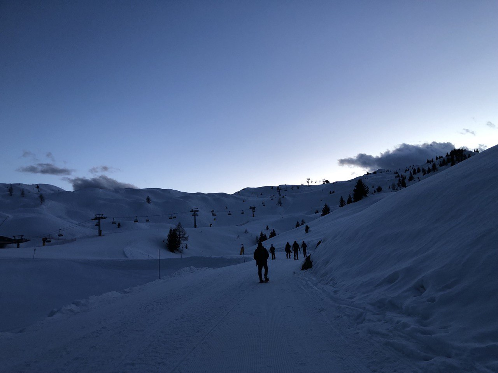

Hi 👋 welcome to a new post.

Today, I want to share a small glimpse of my experience at the 2024 Polenta & Deploy event!

Polenta&Deploy is an event taking place nestled beneath the mountains at Pinzolo. Over the course of three days, developers (and others) come together to enjoy the fresh air and discuss about tech (and not only that...) in an open space setup.

*(Disclaimer: _I didn't attend the previous editions, so please correct me if I'm mistaken)*

It all started after COVID restriction were lifted in 2021, and the ~~old~~ young trio of [Alberto Acerbis](https://www.linkedin.com/in/aacerbis/), [Alessandro Colla](https://www.linkedin.com/in/alessandrocolla/) and [Ferdinando Santacroce](https://www.linkedin.com/in/ferdinandosantacroce/) gathered and pondered "We want to meet people again, we're tired of online events!".

From a telegram chat and a shared google doc, the three were able to organise an unconference, and we are now at the third edition.

Below you can find my "journal" of the event. Enjoy! (I know I'm the only one reading through the entire post, but that's ok 😎).

## My Experience at Polenta&Deploy

### First Day: Trip and Nightly Snowshoe hike

The first day started way before arriving at the hotel. I left bergamo for the mountains with a guest: [Jaga](https://jagasantagostino.com/)! During the trip we talked about his newfound love for home automation (I discovered a great millimiter-wave sensor that can track inside the house, and much more), home servers and his life in Sardinia.

After arriving at the nice small village of Pinzolo, it was time for the first activity of the Polenta&Deploy: lunch! To inaugurate the event, I ate a nice Polenta with pork shank. 

With a full stomach, it was now time for the first **real** activity: along with other fearless souls, we did a snowshoe hike in the Madonna di Campiglio park. It's been been 15 years since the last time I put snowshoes on, and it was not so easy! I did struggle a bit, but in the end we arrived at the hut (well, more like a 5-star restaurant...we're  in Trentino after all). Although we didn't hit our planned destination (we were 1 km short, and 200m below), we were still pretty satisfied. The hike was fantastic. I'd never been on a snowy mountain at dusk before! The atmosphere was unreal, and seeing the sunset over the snow was pure magic.

### Second Day: Unconference (and a lot of food)

After a long night of sleep (about 5 hours), it was time for the main dish of the Polenta&Deploy: the **Unconference**!

We all gathered in the hotel hall and kicked off the *marketplace*. Like in every open space I attend, I stayed back and didn't proposed anything, observing the others discuss where to put their session. I know I'm not getting the most out of the event by not proposing a discussion, session or even just sharing a questionI have. I'm still looking for compelling or "unique" enough not already covered by the other sessions!

I already explained what is an open space [here](https://marcobacis.com/blog/socrates-2023/): the core idea is to let the participants choose what, when and where to talk, by creating a neverending "coffee break".

Here's a (brief) list of the sessions I attended (some for full, others briefly):

**CI: From Stars to Stables** -  [Marco Fracassi](https://www.linkedin.com/in/marco-fracassi/)

In his session, Marco shared his journey with Continuous Integration. It all began during his time at 7pixels, where they had a single (physical) "build machine" shared among colleagues. Despite this ("obsolete" by today standards) setup, they were able to develop effectively with trunk-based development and CI.

However, in In his current company, the CI process is flawed. Developers work in isolation on their branches, which are then reviewed (and approved by at least 2 colleagues), merged into the dev branch and checked by QA. The issue arises after the QA phase: if the feature passes the QA review, it's merged into main - not starting from dev, but from the original feature branch! This destroys the concept of continuous integration, as the dev and main branches are never integrated!

We discussed what might have brought to this situation and how could Marco solve it. The idea is that developing in this way absolves developers of responsibility ("QA approved this, so it must be fine"), yet it doesn't actually improve code quality  or system reliability. In fact, this process risks breaking main, as integration occurs after the checks.

The group discussed some strategies (e.g. abolishing the dev branch, introducing feature flags and so on), but we all came to a conclusion: this situation needs a "social" solution, not only a technical one. Solving the problem requires to break the status quo inside the company, which is difficult when everything is going fine from the economical perspective (even if the code quality suffers).

**Ugly Code and Refactor** - [Gianni Bombelli](https://www.linkedin.com/in/gianni-bombelli/)

Gianni showed us a snippet of production code from one of his past projects, and then asked how we would refactor it. The code was a tangled mess of if-else, but at least it was tested!

The crowd discussed on which steps to take to make the code more readable (e.g. extracting methods, creating interfaces, adding smaller methods, embedding magic numbers into constants etc...). Gianni was able to refactor it using polymorphism (a somewhat-strategy-pattern) and he showed us how they did it at the time.

It was a valuable session on pragmatism (not every refactoring and optimisation is mandatory) and how to work on production code effectively.

**Specops** - [Alessandro Colla](https://www.linkedin.com/in/alessandrocolla/)

Every job advert seems to insist that developers to "must be able to work under stress". We all recognise it as a red flag, but it's something we cannot avoid no matter how hard we try. Given this, how can we train people to handle and manage stress effectively?

Alessandro drew inspiration from his martial arts and combat training and started a discussion with us. We exchanged a lot of quotes, links and ideas regarding team building and humility to stress management and being a great team player in general!

Another nice perk of being at an unconference...the discussion was done under the sun on the hotel terrace! Some of us were on reclining chairs.. as for me, I relaxed on a beanbag chair the entire time (talk about managing stress!).

**Recursive Thought** - [Emanuele Delbono](https://www.linkedin.com/in/emanueledb/)

Emanuele held a live coding session on Elixir, showing the exercises he used while reading the little schemer book (his solutions can be found [here](https://github.com/emadb/the_little_alchemist)).

All the exercises he showed were about recursion. I understood some of them, but the latest were more difficult than expected! His explanation on tail recursion was clear, and I finally understood what it meant.

**Kubernetes Showdown** - [Ludovico Russo](https://www.linkedin.com/in/ludusrusso/), [Andrea Francia](https://www.linkedin.com/in/andreafrancia/)**

In this session, Andrea ranted about Kubernetes, explaining why he think it's too complex to be used in most projects. On the other hand, Ludovico showed his [kubernello](https://www.ludusrusso.dev/blog/2022/09/kubernello), a small VM instance with kubernetes that he uses for small production projects. His setup was quite interesting, with automatic certificates and dns management, gitops and all at low cost! He was so inspiring I might actually create a small k8s cluster on raspberry pis (yes, it might be trivial and not interesting, but I don't care).

**Polymorphism in different languages** - [Angelo Ceccato](https://www.linkedin.com/in/angeloceccato/)**

Angelo started his discussion by showing a graph with all the main programming languages and going back to the roots. Together with the participants, he tried to distill what constitutes Object-Oriented Programming (we had a board full of post-it with definitions). He then tried to link together concepts from all these languages and define the main topic of his discussion: Polymorphism.

I must admit that I didn't follow the discussion too much, but it provided a lot of perspectives on concepts we don't usually think too much about in OOP. It was a trip in the history of programming languages concepts and styles.

**There is no silver bullet** - [Alberto Mori](https://www.linkedin.com/in/morialberto/)

Alberto asked for help/feedback on a talk he proposed to a conference. The title of his talk was "There's no siver bullet" (a clear reference to Fred Brooks' paper, even if he didn't know it 😂) and the idea was to discuss complexity and how some techniques, even if not perfect, can help reduce it.

What started as a feedback session became a discussion on managing the complexity of human and business behaviour. We talked about essential and accidental complexity, different "layers" of complexity, on how a company can learn to tackle the complexity and how to communicate it to the customer and the developers without being overwhelmed by the task.

### Third Day: Unconference and Goodbye

The last day started with a good breakfast (the perks of good conferences). While a small group went out for a *short* hike (more on that later), we picked up where we left off the day before and continued the unconference.

Here are the sessions I attended (just three, we finished by midday):

**Intro to Qwick** - [Ludovico Russo](https://www.linkedin.com/in/ludusrusso/)

A nice quirk of unconferences is the chance to ~~force~~ *ask* other people to give sessions. This was the case, when Gerson asked Ludovico to show him how [Quik](https://qwik.dev/) works!

Ludovico obliged to the request and showed us a small example of a quik application, explaining its Server-Side-Rendering approach (resumability). I didn't know much about SSR, but I will try to learn it more after getting a glimpse of what it can do!

**1-on-1 for dummies** - [Maddalena Germinario](https://www.linkedin.com/in/maddalena-germinario/) 

Maddalena had her first-ever round of 1-to-1 sessions with her team after becoming tech lead... and she asked for our feedback on how to improve! The group had a discussion on how to have a great 1-to-1s, from the perspective of both the team lead and the members. 

We talked about trust, career development, feedback, psychology, tools and methods, and it was a great source of information about 1-to-1s and how to treat people at work in general (and how to manage 1-to-1 sessions as a manager without getting crazy afterwards).

**Intro to Hono and Deploy to prod on Kubernello** - [Ludovico Russo](https://www.linkedin.com/in/ludusrusso/), [Federico Gandellini](https://www.linkedin.com/in/federicogandellini/)

The final session of Polenta & Deploy witnessed a historic moment as Ludovico and Federico executed the first ever production deployment during a Polenta&Deploy event!

Federico wanted to create a small application using [Hono](https://hono.dev/), a framework for developing backend APIs and websites in nodejs. Together with Ludovico, they developed a small application and then deployed it on Ludovico's kubernello.

Watching them develop and deploy a small page in 30 minutes was impressive, and it left me inspired to create my own small kubernello setup!
I won't share the final url (just in case someone decides to DDoS kubernello 😅), but trust me, it was a great session.

## The End
After the unconference ended, we went to a restaurant in the mountains near Pinzolo and waited for the others.

I made a good choice staying at the hotel for the unconference... the *small* hike the other group started in the morning turned out to be a 3/4 hour-long adventure in the snow (sans snowshoes this time) and the group came back late, tired, and wet!

We ate the last polenta, and as the rain started to fall and replace the snow around us, it reminded us it was time to go home.

This Polenta & Deploy was great. I already had my unconference initiation at [SoCraTes](https://marcobacis.com/blog/socrates-2023/), and I firmly believe this format is way better than any standard conference.

An unconference offers a safe, intimate space where everyone can share their opinions, provide feedback, and support others. Being surrounded by the Trentino mountains was the cherry on top for me. While I'm not particularly happy to hike on them (too hard!), I do love being in the mountains and spending time with like-minded people, so this was an incredible opportunity.

Thanks again, and see you next time! 
