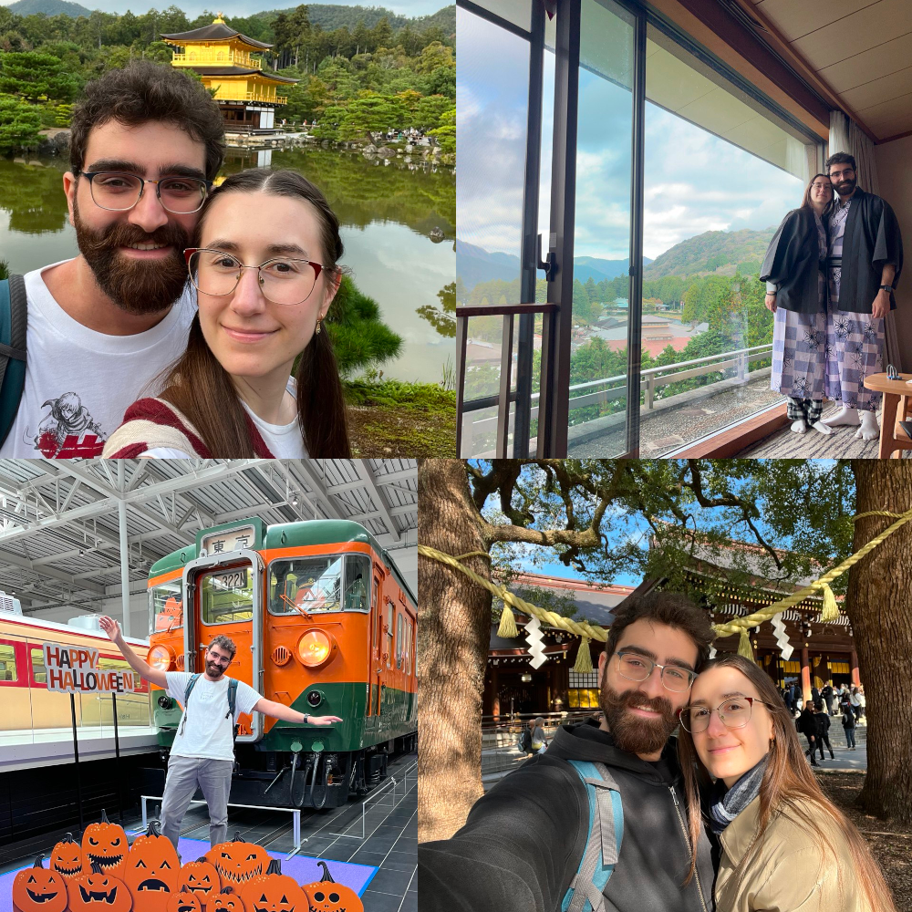

Hi 👋 and welcome to the usual end-of-year recap! Right before Christmas, I take some time to reflect on the year that has passed, and write some observations here on the blog ([2022](https://marcobacis.com/blog/2022-a-review/), [2023](https://marcobacis.com/blog/2023-review/)).

This time it's not different, so let's start!

<!--more-->

## 2024 Goals Review

Let's start with a brief review of the goals I set for myself for 2024:
#### ❌ Write more

The first goal I set for 2024 was to write more on this blog, and in particular to focus more on programming (less journals and reviews, more code)!

In 2024, I wrote 9 post...less than 2023! Definitely didn't reach the "1 post every two weeks" I set as goal at the beginning of 2024.

#### ✅ Exercise

This year I focused more on exercising than last year. I regularly (2 times a week) went to a gym ([@performa](https://www.instagram.com/performa_bg/)), lost 5kg and in general led a healthier lifestyle than before. I didn't reach 85kg or less yet, but I still think this is a win!

For next year, I will focus more on health, maybe increasing my gym attendance to 3 times a week + a short run once in a while (to get some fresh air instead of the sweaty one at the gym 😅).
#### ❌ Speak somewhere

In 2023 I attended a lot of conferences and meetups. This inspired me to set a goal for 2024 to "speak somewhere"... which I didn't. Same thing as taking care of the blog, it takes creativity and constant work to keep a habit of writing or speaking, and I simply didn't put effort into this.

I hope this will change in 2025! I still have no ideas for a talk, but I hope that putting more effort into the blog will bring some ideas for talks too! I also plan on attending more "unconferece"-style events in order to practice speaking, even without an agenda or a talk ready.
#### ✅ Learn across the stack

I definitely learnt a lot in 2024. Spoiler: I set this goal right after starting my new job at [Zupit](https://www.zupit.it/), so I knew there will be learning involved.

In 2024, I extended my knowledge of C#/.NET and learned to work on the frontend too, with Angular. I also refreshed my knowledge of CSS (more on that on a blog post, maybe...) and learned a bit of mobile development with flutter (the project got canceled before starting, but I still prepared with a course on Dart and Flutter 😁).
#### ✅ Attend conferences and meetups

Attending conferences and meetups was an easy goal I set for myself for 2024 to force me to get out of the house and meet people. And it worked 😅! I attended a lot of events (maybe less than 2023, but still more than I expected). More on that later.

## Work
Time for a proper review of 2024! Let's start from work.

I left [e-Novia](https://e-novia.it/) in December 2023. Even if the job was interesting and involved a lot of learning across the entire stack (from firmware to web and even gaming) I wasn't ok with the policy around remote working and the overall "slowness" of the projects. We treated startups like standard consulting customers, with waterfall-like planning and a lot of rigidity. I was looking for a more "agile" company.

I looked for alternatives, and found [Zupit](https://zupit.it), a small consultancy from Trento focused on learning, continuous improvement and performance. The biggest perk that attracted me was Zupit part-time policy 😏: 30 hours/week and remote, what could I ask more? I could focus my newly-freed time on learning, improving myself and so on.

And I have a lot of free time now! Between the 10 hours of work saved, and the many more hours saved from commute (I was commuting daily, about 3 and half hours each day...) I have a lot of time to relax, study and have fun.

I invested part of this free time to improve myself. In 2023 I started going to the gym on saturday morning (the only time I could). In 2024 I started going 2 times a week in the afternoon, to save time on the weekend and stay with my family. I also plan to increase to 3 times a week 😎.

Another thing that I do with this time is learn. While before I would have studied during the commute or in the evening, now I have time to study in the afternoon. Right after entering Zupit I studied Angular, to catch up with what the team was using. I had never used the framework, so I had a lot to learn. After that, I dabbled a bit with Flutter, even I I still hadn't used it at work. Now, I have a list of technical books I want to read, along with keeping my Rust knowledge up-to-date, even if I might not use it for work right now.

Finally, the last thing I do with this time is....relax. Not everything in life has to be done for a purpose, and I reject the idea that we should be all working all the time. I am definitely not competitive (in fact, I was never successful at sports), so sometimes I take time to relax by reading a good book, taking walks around the town (I discovered parks I didn't know existed) and doing things slower. Since I left my job in Milan, I noticed I've become more calm and even slower in my movements and thoughts!!

In addition to working less, Zupit advocates for continuous improvement and learning. We work 6 hours a day, but to compensate that we need to be more productive and mindful during that time. During 2024, I learned how to focus more during work hours, and improved my productivity both because of this, and also thanks to the better developer experience we have in Zupit. (Most of) projects follow a standard format, we use the latest tools (e.g. jetbrains suite before it was free, chatgpt, copilot) and have a seamless deployment experience (mostly thanks to our Tech Leads and volunteers which keep the pipelines running 🥰).

I must say, I miss the office a bit. Trento is not so far from my hometown, but it's still more than 2 hours by car each way. In my previous job I advocated for full-remote work, but now this personal belief is starting to crack. Working alone in a room is not the same than working with others IRL, even with low-latency video calls and messages. Whenever I can, I look forward meeting with the team in person, but I think it doesn't happen often enough because of the cost this presents (for me, and for the company...hotels aren't free!).

## Writing

My goal for 2024 was to write at least 20 posts, or even better to begin posting every two weeks. I definitely didn't reach that goal 😅.

This year I published 9 posts (+ this one you are reading):
- [My Experience at the Italian Agile Days 2023](https://marcobacis.com/blog/2023-italian-agile-days/)
- [Milan XPUG January Meetup: My Advice on Microservices Architecture, by Gabriele Lana](https://marcobacis.com/blog/xpug-milan-meetup-microservices/)
- [My First Open Source contribution ever @ Open Source Saturday Milan](https://marcobacis.com/blog/2024-feb-open-source-saturday/)
- [Show your Work!](https://marcobacis.com/blog/show-your-work-book/)
- [Polenta & Deploy 2024](https://marcobacis.com/blog/2024-polenta-and-deploy/)
- [Let's build a Load Balancer in Rust - Part 1](https://marcobacis.com/blog/load-balancer-rust-1/)
- [Let's build a Load Balancer in Rust - Part 2](https://marcobacis.com/blog/load-balancer-rust-2/)
- [Let's build a Load Balancer in Rust - Part 3](https://marcobacis.com/blog/load-balancer-rust-3/)
- [Update Conference 2024 Journal](https://marcobacis.com/blog/2024-update-conference/)

Two of them (IAD 2023 and "Show your work") were actually written in part in 2023, so this brings the gran total to 7 new posts written in 2024...less than once a month!!

There are a lot of ~~excuses~~ reasons to explain why I didn't stay consistent during 2024: lack of ideas, impostor syndrome, personal committments (more on that in the [last section](#personal)). I think the most obvious reason is that I didn't put enough effort in this blog. I definitely had time to write (see the [previous](#work) section), but didn't find what I was doing at work interesting enough to be published, or didn't try to make it more interesting 😅.

I still had fun writing these posts. The three-part series on writing a load balancer in rust also landed on the [This Week in Rust](https://this-week-in-rust.org/) newsletter (on [Marco Ieni](https://www.marcoieni.com/)'s advice, he forced me to propose the posts!). I really liked writing the load balancer and explaining in detail how I implemented it. It also was a lot of work! I kept changing the load balancer code while writing the posts. In the end, writing forced me to learn more about async Rust and to keep my code clean and clear for the audience, which is exactly why I think writing is the best way to learn a new concept.

Now, some spoiler for 2025: I just bought the book "[Writing for Developers](https://www.manning.com/books/writing-for-developers)" by Piotr Sarna and Cynthia Dunlop. I plan to read this right at the beginning of the year, to inspire me and get some tips and tricks on how to find post ideas and executing on them.

I also just finished reading [Learning Domain-Driven Design](https://www.oreilly.com/library/view/learning-domain-driven-design/9781098100124/) by Vlad Khononov, and plan to write a couple of posts with my summary (it will force me to re-read the book and get more out of it).

Finally, I plan to attend more conferences this year (see next [section](#communities)) and will probably write about my experience there 😉.
## Reading

This year I read significantly less than in 2023 (23 books instead of 28). This continues the trend from 2022 (32 -> 28 -> 23).

Since working remotely I noticed I am reading less books, and instead have increased my screen time. I suppose that commuting forced me to read rather than watch videos (both for the sound - the train can be very noisy - and for the bad connectivity in some areas). I hope to reverse this trend, resist the TV and smartphone and get back to reading more books next year!

BTW, here's the list of books I read this year (courtesy of my [goodreads profile](https://www.goodreads.com/user/show/22830084-marco-bacis)):
*(Disclaimer: didn't want to translate the titles, so if I read the book in italian the title will also be in italian)*
- *Fulmine Globulare* by Cixin Liu
- *Il pensiero Nordico* by Anna Brännström
- *Piranesi* by Susanna Clarke
- *Le Cosmicomiche* by Italo Calvino
- *La misura del mondo* by Daniel Kehlmann
- *Steal like an Artist* by Austin Kleon
- *Building a Second Brain* by Tiago Forte
- *Flow* by Mihály Csíkszentmihályi
- *Abel* by Alessandro Baricco
- *Keep Going* by Austin Kleon
- *Futurama e la filosofia* by Courtland Lewis
- *Kitchen* by Banana Yoshimoto
- *La vera storia del pirata Long John Silver* by Björn Larsson
- *Frankenstein* by Mary Shelley
- *Tidy First?* by Kent Beck
- *La luce delle stelle* by Licia Troisi
- *Il gatto che voleva salvare i libri* by Sōsuke Natsukawa
- *22/11/63* by Stephen King
- *Feel-Good productivity* by Ali Abdaal
- *Thinking in Systems: A Primer* by Donatella H. Meadows
- *Il passeggero* by Cormac McCarthy
- *L'ora di greco* by Kang Han
- *Learning Domain Driven Design* by Vlad Khononov

And here are some books I started in 2024, but didn't finish:
- *From Objects to Functions* by Uberto Baldini
- *How to Read a Book* by Mortimer J. Adler
- *Lezioni di Fiducia per diffidenti* by Olga Chiaia
- *Terraform: Up and Running* by Yevgeniy Brikman

I'm sorry for not finishing them, and most of all the book from Uberto (*From Objects to Functions*): I really enjoyed following the first chapters. Following along the book with the code (copying it) was not straightforward, and also my lack of knowledge in kotlin didn't help 😅. I still plan to read it in 2025, so you'll find it in the "read" list next year!
## Communities

This year I continued the trend started in 2023 of going to conferences and meetups near me. I love participating in these events, as they allow to both keep updated on new technologies and to meet new people and old friends.

Thanks to Zupit, this year I was also able to attend an international conference on .NET (spoiler: I already bought the ticket for next year 😝). It was a great way to breathe some international air, meet the Prague .NET community and update my knowledge of .NET and related stuff. I also [wrote](https://marcobacis.com/blog/2024-update-conference/) about the conference.

As usual, here's the list of conferences and meetups I attended in 2024
Conferences (and unconferences):
- [Codegen 2024](https://cloudgen.it/codegen-2024/)
- Polenta & Deploy unconference - [Journal](https://marcobacis.com/blog/2024-polenta-and-deploy/)
- [Web Day 2024](https://www.webdayconf.it/2024)
- [Working Software Conference](https://www.agilemovement.it/workingsoftware/)
- [Update Conference Prague](https://www.updateconference.net/) - [Journal](https://marcobacis.com/blog/2024-update-conference/) 

Meetups:
- [XPUG Bergamo](https://www.linkedin.com/company/xpug-bergamo/)
- [XPUG Trento](https://www.linkedin.com/company/xpugtn/)
- [XPUG Milano](https://www.meetup.com/it-IT/xpugmi/)
- [Crafted Software](https://www.meetup.com/Crafted-Software/)
- [Open Source Saturday Milano](https://www.meetup.com/Open-Source-Saturday-Milano/)
- [ReactJS Milano](https://www.meetup.com/it-IT/react-js-milano/)
- [.NET Italian User Group](https://www.meetup.com/it-IT/ugidotnet/) (UGIdotNet)

A nice addition to the list of meetups is the XPUG groups in Milan and Trento: while Milan is a destination near me, the Trento group was created this year, and I was able to participate to their meetups and also go the office the day before/after. Two birds with a stone!

For next year, I plan to attend at least the same events as 2024, with the addition of FOSDEM (as I did in [2023](https://marcobacis.com/blog/2023-my-fosdem-experience/)) and other Unconferences (like [SoCraTes](https://www.socrates-conference.it/)), which I didn't attend this time because I was in another continent (🇯🇵, see below).

## Personal Life

If 2023 was marked by a sad news (Lucky 😭), 2024 had a really positive event.

In December 2023, given my new free time, I took some time to find a nice ring. In February, I bit the bullet and finally proposed to my girlfriend, so...we got married in October 💍!

Right after the wedding, we departed for a 3 week trip to Japan. I had already been there in 2023, but it was nothing compared to our honeymoon! We visited Osaka, Kyoto and Tokyo with short trips to Nagoya (where we visited my favorite place: the [Japan Rail Museum](https://museum.jr-central.co.jp/en/)!!), Kanazawa, Shirakawa-go, Takayama and Hakone (a fantastic hot spring area, with a terrible traffic).

Japan was wonderful, and I cannot wait to go there again 😍

## 2025 Goals

It's time for the "Marco dreams up impossible goals to set for next year" section!
After careful considerations, here they are:

#### Write more

Last year I made a goal of writing every two weeks on this blog. This time I won't commit to a specific cadence. However, the goal is to write more freely on the blog, without listening too much to the impostor living in my brain.

Is the content original/advanced/deep enough? Will someone care? Will I get any reads? Am I exposing how smart I am, how much I know?

These are all thoughts and questions that I will have to ignore while writing. Simple! Whenever I see something interesting, I'll write here, even if it ends up being a 3-lines post.
#### More exercise

This year I was able to exercise two times a week by going to a personal trainer. Time to take off the training wheels and subscribe to a public gym!

The goal is to exercise at least 3 times a week, either with the personal trainer or without. Also, I should lose some fat, getting to around 80kgs...

#### Contribute to Open Source

Last year I attended the [Open Source Saturday Milano](https://www.meetup.com/Open-Source-Saturday-Milano/) event to force me to contribute to any OS project. I did it, but with a lot of hand-holding and help from the folks there. Also, I didn't continue contributing to the projects I saw there.

For 2025 this needs to change. Contributing to Open Source is a great way to give back something to the community, to learn new technology and in general to have fun. I hope to find at least one project and actively contribute to it!

#### Publish a Video/Talk

This is the third time I promise to create more content, so it better be the last one I promise, and the first time I actually deliver.

In December I tried live-streaming while solving some Advent Of Code challenges ([here](https://www.youtube.com/@marcobacis-dev) is the channel). The first time I was anxious and did a lot of errors, while the following days were easier. 

Live-streaming is an easy way to show myself in public without too much background work (such as editing). The goal for 2025 is to keep streaming (e.g. try solving other challenges, maybe streaming while contributing to a project or learning a new technology). This fits with the [Learn in Public](https://www.swyx.io/learn-in-public) goal I had two years ago.

Another evergreen goal is to give a talk somewhere 😅 we'll see how that goes, as I fist need to find something interesting to talk about (can you hear the impostor talking?).

## Conclusions

That's all! 2024 was great. I learned a lot, met new people, traveled and also had one the most important moments in my life.

I hope 2025 will be even better, so let's start it with a smile and a lot of good intentions (not forgetting the effort and work to make it happen)!!

See you next time!