Hi 👋 Welcome back!

Two years ago, I attended my first unconference, [SoCraTes IT](https://www.socrates-conference.it/)! It was eye-opening: an event where the agenda is created on the spot, and where everyone can share, discuss, and showcase their ideas and projects in an [open space format](https://en.wikipedia.org/wiki/Unconference).

While last year I couldn't come (I was on my honeymoon), this year I came back to immerse myself again in that atmosphere. In this post, I'll share my usual "journal-style" reportage of the event 😁.

PS. To see how an Open Space works, check out my [previous post](https://marcobacis.dev/blog/socrates-2023/).

| | |
| ------------------- | -------------------- |
| 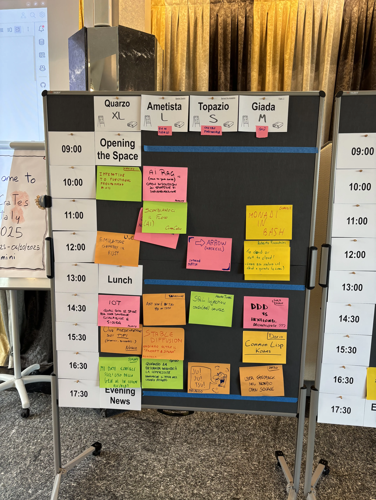 | 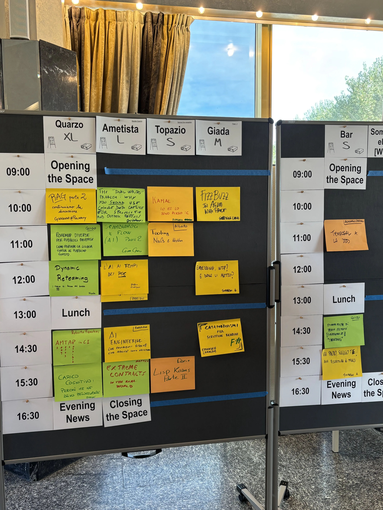 |

## Ice Breaker

The unconference started strong on the evening before. Upon arrival, the bar was filled with canvases. Each one had a title (e.g., "your real opinion about agile," "the first thing you'd outlaw in software if you magically became a benevolent dictator tomorrow"), some post-its, and markers. By moving around the room, you could write and discuss your opinions on the subjects. I think it was a great ice breaker, a nice diversion from last year's format (which was way more interactive and not suited to a group of programmers 😂).

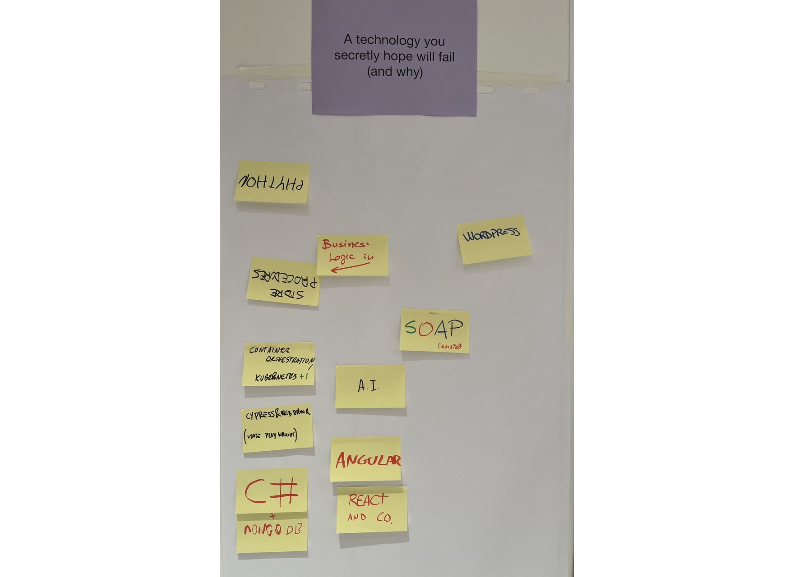

## First Day

### Imperative to Functional Programming Kata - [Cosimo](https://www.linkedin.com/in/cosimo-matteini-138a22188/)

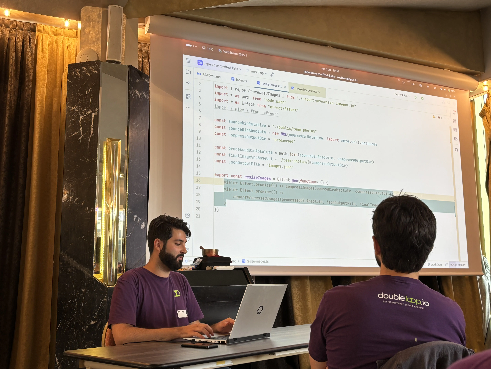

The event started out great, with Cosimo showing us how to transform imperative TypeScript code into a functional style.

He first showed the kata: an image resize program. The program was fairly simple, but he wanted to use functional programming to achieve the same outcome, all without rewriting it from scratch. He showed us that this is possible using the Effect TypeScript library. 

[Effect](https://effect.website/) is a TypeScript library for building composable applications. It provides a lot of building blocks, but its most useful application for this kata was the possibility of mixing functional and imperative code, so that we could transform the code one piece at a time. Effect provides two ways to do so:
- [generators](https://effect.website/docs/getting-started/using-generators/) 
- [pipelines](https://effect.website/docs/getting-started/building-pipelines/) (very similar to reactive programming libraries such as RxJS)

The most interesting feature of Effect (and in general of functional programming languages) is that of *lazy evaluation*. All we were doing was defining the computation one block at a time, but without running the actual code... all operations were delayed until the last possible moment (when they were applied). Pretty neat.

The kata can be found [here](https://github.com/devmatteini/imperative-to-effect-kata).

### Monads in Bash - [Gianni](https://github.com/bombo82)

Continuing the theme of functional programming, Gianni wanted to understand Monads (I still don't know exactly how they work) by reimplementing them in a language he knew.

Kotlin? Nah, it already has functional constructs.

Go? No, if he got serious, he could also have success in that.

What language did he choose in the end... bash!!!

He showed us how he implemented the `Maybe` construct (which indicates either a value or the absence of it) and the `map` method. The work was filled with tiny hacks (e.g., hardcoded strings to define `Nothing` and using pipes to represent list elements) but nonetheless very cool!! He cleverly used side effects (the only way to work effectively with bash) to simulate functional constructs in an otherwise very imperative language.

It has a lot of potential.

### Gameboy Emulator in Rust - [Luca](https://www.linkedin.com/in/luca-torriani)

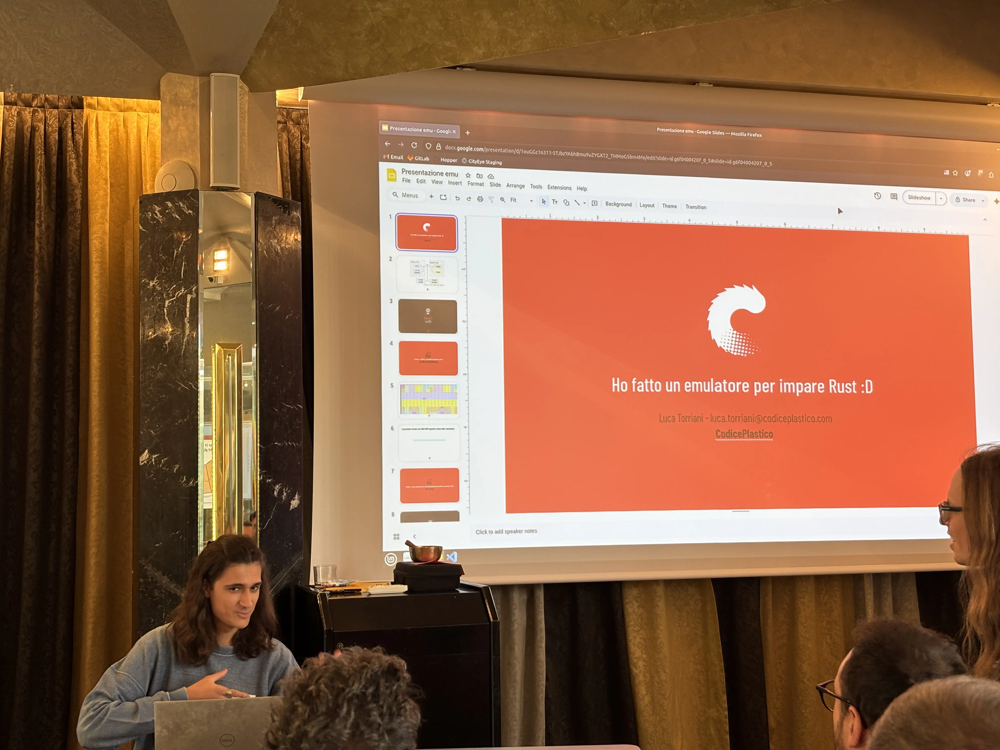

Coming down from the heights of functional programming, I wanted something closer to the hardware... and what better opportunity than watching a Gameboy emulator written in Rust?

Luca described all the nuances and details that go into implementing a hardware emulator. It was not a Rust talk (even if he used it to learn), but a deep dive into how crazy hardware architecture was in the 80s/90s.

The thing that was craziest for me was graphics management. First, graphics are managed with 3 different constructs:
- background
- window
- sprites

Each one has different memory management: for example, the background is on memory 4 times bigger than the screen and is rendered by indicating the offset in that memory (which can also "roll" from right to left!). The window has a fixed position on the screen and is updated by indicating the elements displayed. The sprites are on separate memory and get the highest priority in the rendering. 

Luca implemented everything in Rust to learn it, so the code was not so idiomatic. However, he made sure to implement a correct emulator by making it pass all tests, which consisted of actual binaries to run on the emulator. Talk about end-to-end testing!

### DDD vs Hexagonal Architecture - [Luca](https://www.linkedin.com/in/lucagiovenzana/)

Luca held a discussion on the nature of Domain-Driven Design and how it relates to Hexagonal Architecture. 

It all started from a comment on LinkedIn ([here](https://www.linkedin.com/feed/update/urn:li:activity:7377325627579916288?commentUrn=urn%3Ali%3Acomment%3A%28activity%3A7377325627579916288%2C7377351154210521088%29&dashCommentUrn=urn%3Ali%3Afsd_comment%3A%287377351154210521088%2Curn%3Ali%3Aactivity%3A7377325627579916288%29)) in which a commenter said that mixing DDD and HA brought painful misconceptions. Luca didn't understand the issue and brought it to the group. What followed was a discussion on what DDD really is, and why Hexagonal Architecture is not the same thing.

From what I understood, DDD relates to the business decisions about the architecture: what components should be implemented in-house ("core" and "support" domains) and what can be left to existing systems or contractors ("common" domains). Hexagonal Architecture is instead a particular architectural style used to structure our code (using inversion of control as a tool to protect the core domain from all side effects, e.g., API controllers and database implementation). This aligns with what I have studied reading [Learning DDD](https://www.oreilly.com/library/view/learning-domain-driven-design/9781098100124/) by Vlad Khononov.

Mixing the two concepts (thinking you are doing DDD only because you follow Hexagonal, or the inverse) can lead to misconceptions. Luca thought that Hexagonal Architecture is always useful and at zero-cost, but others didn't think the same, and that's why he started the discussion from that post.

It was a nice discussion! After, I kept thinking about architecture 😅 (e.g., how I don't use either DDD or Hexagonal Architecture at work, and how to introduce them).

### A Presentation on Types - [Nusco](https://www.linkedin.com/in/paoloperrotta/)

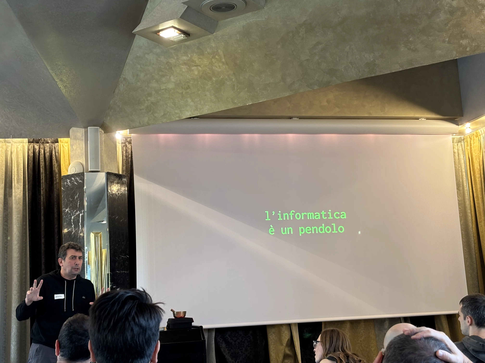

Paolo brought a talk on static vs dynamic typing. Said like this, it could seem like a simple argument, but he showed how deep the rabbit hole goes.

First, programming is a pendulum. Trends come, go, and come back! This is true for architecture (monoliths -> microservices -> monoliths), for where to put computation (remote vs local), but also for type checking in languages!

We always talk about static vs dynamic typing, but Paolo explained that we should be more precise with our definitions. What actually changes is *when* the types are checked.

The concept I bring home from this talk is: every language has types (apart from Forth, it seems). Some languages are more strict, others less, some check at runtime and some at compilation; some infer types and others don't. Paolo's talk was interesting and eye-opening, but most of all hilarious 😂 it was great.

By the way, Paolo is the author of *Metaprogramming Ruby* ([link](https://pragprog.com/titles/ppmetr2/metaprogramming-ruby-2/)) and of some courses on [Pluralsight](https://www.pluralsight.com/authors/paolo-perrotta), check them out!!

### Jujutsu - [Arialdo](https://arialdomartini.github.io/)

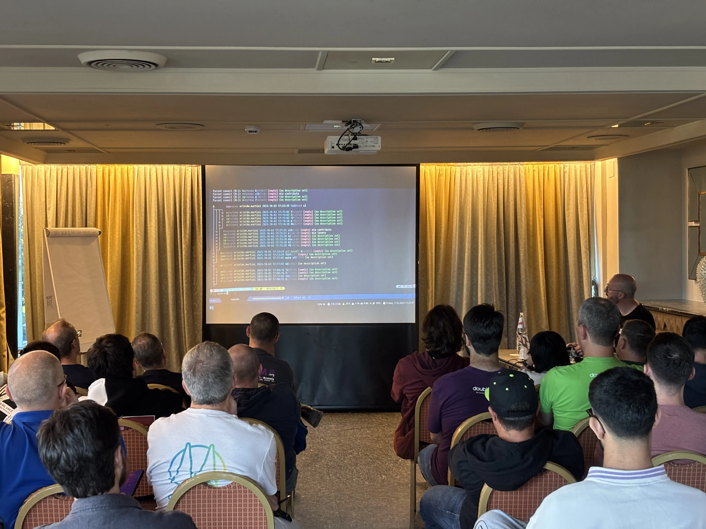

In the final session of the day (or at least I thought), Arialdo showed us the new cool kid in the town of versioning tools: [Jujutsu](https://jj-vcs.github.io/jj/latest/). It's a version control system that extends Git with some neat commands and patterns... and provides extreme freedom to move commits and branches around.

Arialdo showed many commands and tricks that would be cumbersome with Git, but just a command away with Jujutsu: renaming commits, moving commits, creating temporary merge commits to keep in sync with all changes from others, moving stuff around, and so much more.

After his demonstration, I'll definitely try it (even though I don't use fancy commands and my final goal would be trunk-based development... 😇).

### Bonus Pre-dinner Session: XPUGBg Book Club

Every Friday (almost) I attend a Book Club organized by the XPUG Bergamo group. Being a Friday, and also being most of the members present at SoCraTes, why not hold a session before dinner?

At the moment (and also at the moment of writing this post), we were reading the book "Seven Languages in Seven Weeks" by Bruce A. Tate ([link](https://pragprog.com/titles/btlang/seven-languages-in-seven-weeks/)). 

We re-read (we were actually stuck on that) the chapter about Prolog, trying to reproduce the book example on map coloring, but without using the same structure as the book used! It was difficult (and we didn't reach the conclusion), but being all together physically made the experience even better!

### Bonus Night Session: A Forth Interpreter in Rust

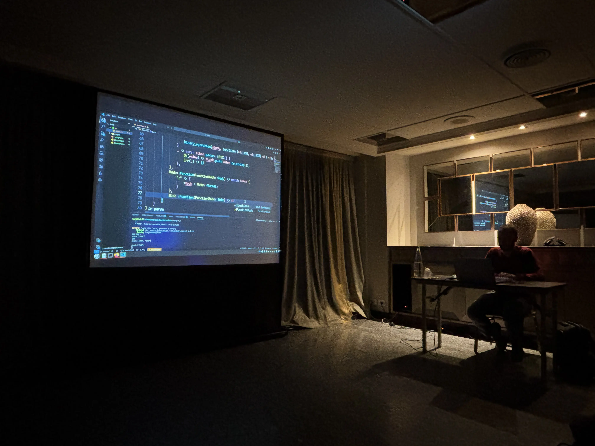

During his [talk](#a-presentation-on-types), Paolo mentioned that building a Forth interpreter is an easy task and he does it to learn a new language.

So, some participants (including Luca, the GameBoy emulator guy) started implementing an interpreter for it... in Rust!! I came in after some time and they were almost finished.... but that's the kind of spontaneous sessions you can only see at SoCraTes! I now want to write an interpreter by myself.... 😁

BTW, [here](https://github.com/lucaTorrianiCP/forth_interpreter)'s the result.

## Second Day

### FizzBuzz in Agda - [Gabriele Lana](https://www.linkedin.com/in/gabrielelana/)

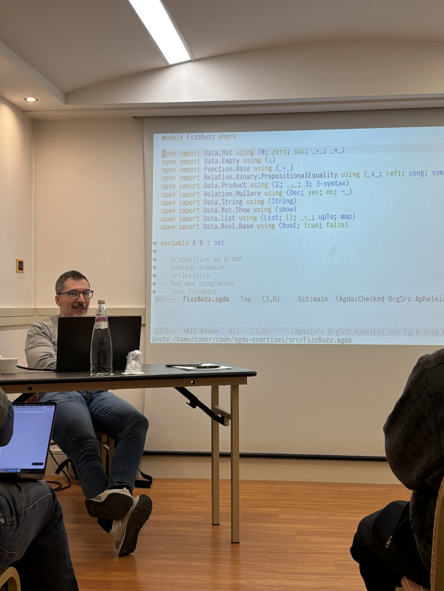

Gabriele gave the first presentation of the day. To start slowly, and acclimate our brains to the challenges of the day, he used FizzBuzz, an easy and standard exercise, usually performed at interviews to filter out candidates.

The twist? He **proved it formally**, using [Agda](https://github.com/agda/agda). Agda is an interactive system for writing and checking proofs (yes, in the mathematical sense). If the day before we saw Nusco talking about statically checked type systems, a theorem-proving system goes way beyond: it allows us to demonstrate the intrinsic properties that an algorithm or data structure has. It's the pinnacle of testing, and the mortal enemy of bugs: a proven algorithm has no flaws!

Why aren't we demonstrating every program we write? Well, theorem proving is quite difficult, sometimes [to the extreme](https://en.wikipedia.org/wiki/NP-completeness). Also, expressing an algorithm mathematically is way more difficult than it seems: Gabriele took an hour just to show us how to prove that integers are integers...

In the end, we got a glimpse into the world of formally verifiable programs, a niche reserved only for the most critical systems. It was a mind-blowing experience (I had a headache after the session).

### Temporal "a la" DDD - [Ruggero](https://www.linkedin.com/in/ruggero-enrico-visintin/), [Pietro](https://www.linkedin.com/in/pietro-marchini-6a2545109/)

After seeing the power of mathematics and software, I went for a stroll in the hotel lobby, headed to the bar. There, I found Ruggero asking for help on architectural matters at his job.

I won't give any details, but we had a nice discussion on how to decouple "invasive" systems, such as [Temporal](https://temporal.io/), from the core domain of applications. Also, how do you handle migrating a legacy system that is coupled with such systems?

I left the bar with more questions than before.

### Dynamic Reteaming - [Nicola](https://www.linkedin.com/in/nicola-moretto-ba197040/)

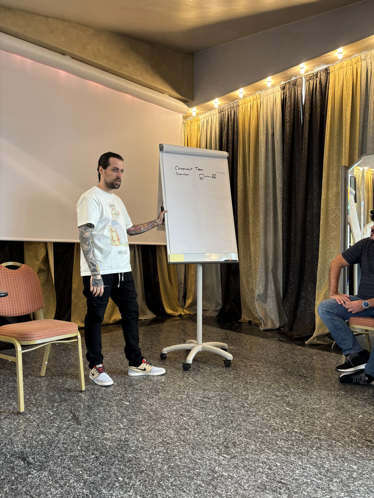

How do you handle teams in a product company? And how does that relate to your software architecture?

Nicola started an interesting discussion (which derailed from his intended purpose) on [Dynamic Reteaming](https://www.amazon.com/Dynamic-Reteaming-Wisdom-Changing-Teams/dp/1492061298). 

Most companies divide teams based on their specialization: frontend, backend, devops, DBA, etc... Others instead use cross-functional teams, where each part of the system is seen in its entirety by a team, which has full responsibility and agency over it.

When trying to move from the first type to the second one, however, if the software architecture doesn't follow the people, we risk a disaster. If a frontend developer is thrown into a newly founded cross-functional team, they will still talk with other frontend developers if all the frontend code is still in the same place (and has the same structure) as before.

What Nicola learned from the book (and applies in his work with [Qmates](https://qmates.tech/)) is to slowly turn both the organization and the architecture where needed. For example, a single cross-functional team might be extracted from the specialized teams, and the architecture must follow by extracting the "slice" from the software, making the team really independent.

It was a nice discussion, and I learned that organizations can, and should, be more "fluid" in their team structures. I still wonder how this relates to my job (working in a small consultancy, where each team has its project but not all roles are "covered"), but it was still enlightening.

### Catamorphisms for Recursive Structures

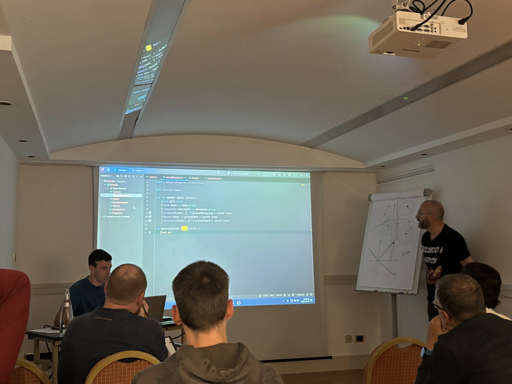

At SoCraTes, there is a move that gets its distinctive name from its original creator: the *Arialdo move*. An Arialdo move consists of proposing a session in which *someone else* has to give a presentation/workshop/talk/whatever.

This year, Arialdo did his move with Emanuele, forcing him to give a session on [Catamorphisms](https://en.wikipedia.org/wiki/Catamorphism) in F#.

I got into this session late and didn't follow it enough to understand what catamorphisms are 😅. Nonetheless, the Arialdo move is one of the things that make an Unconference memorable! 

### Extreme Contracts discussion - [Matteo](https://www.linkedin.com/in/matteototo/)

The last session of the day was more relaxed than the rest. Matteo started a discussion on the book [Extreme Contracts](https://leanpub.com/extremecontracts-italia) by Jacopo Romei.

How should we value our work, or how should a company give prices to its consultancy work? Some just bill the time spent developing software (more risk to the customer, as they might be paying for nothing). Others provide a precise estimate and use a project-based pricing model (riskier for the contractor, as scope is usually underestimated). 

The book provides a third way, which is asking for *value*. If the customer is going to spend less (or be more profitable) thanks to my work, then we should ask for a part of that profit (in addition to a lower base fee)! 

I also offered a different solution, which is the one employed by [Zupit](https://www.zupit.it/): use an agile contract and make the customer pay for the value delivered (measured using Story Points) for each sprint. I don't think it's a perfect model (actually, using story points as price is against agile principles in my opinion), but it allows us to reconsider the relationship with the customer periodically and lowers the risk for both parties. The customer is paying for actual features delivered, but without the risks on long projects.

## The End

Well, that's it! This was SoCraTes 2025.

I didn't add all the little trivia (e.g., mechanical keyboards, chess and board games challenges, and of course... beer) that accompanied the main event. Unfortunately, those can only be lived by being there.

I hope this journal made you want to attend the next SoCraTes, or another similar event. Unconferences are a great way to learn, discuss, and have fun.

See you next time!