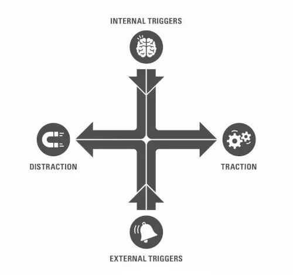

Hi 👋 welcome to a new post!

I'm starting to enjoy writing short summaries about books I read, so here's a new one 😛

**Indistractable** is a book by [Nir Eyal](https://www.nirandfar.com/), a *behavioural engineer* who worked and studied the psychology of our attention and applied it to digital product and advertisements. In fact, his first book (”Hooked”) is about the design of habit-forming products (such as games, ads, apps and so on). <!--more-->I didn't read this first book, but it's right next on my reading list!

If in his fist book he unveiled how products make us “distractable” and easily influenced (looking at you, Facebook and TikTok!). This book is instead the complete opposite, as Nir explains all the strategies and behaviours we can adopt to *regain our attention*.

## Why should we be “indistractable”?

Nowadays, distractions are everywhere: TV, smartphones and social networks are just the tip of the iceberg in the ways our mind tries to distract herself. But the issue is not only technological, and it has deeper roots in our psyche.

Distraction brings us away from what's important: it can be studying and working, but also having meaningful relationships (do you remember the last time you “really” talked with someone, without turning your smartphone screen on?).

We want to do the right things, but we should also learn how to avoid the *wrong* ones, and distraction is one of the bad things pulling us away from our actions. 

So, being **indistractable** can be considered a superpower, which allows us to be present and more productive, and in general better people.

## How to become indistractable?

Our actions can be pulled by two forces: distraction (moving away from what we want) and traction (moving towards our goals). To become indistractable means to follow traction! Traction and distraction are the **outcomes**, while at the input of we have **triggers**, either internal or external. Let's see how to control these four elements.

### 1. Master internal triggers

This is the most important part in my opinion, and also the most difficult. We always blame people, tools, the weather, anything for our actions, but in reality the most important triggers are inside our mind. The other causes we blame instead of ourselves are called *proximate causes*, as they help us deflect the responsibility to someone/something else.

The reality is that humans do not get distracted to follow pleasure (social media, food, drugs and so on), but to **escape** discomfort.

For example, when I'm bored I try to avoid it by going on YouTube, or by eating. When I'm writing (right now!) I try to do anything else rather than staying  calm and *thinking* about what I should write. The ones I described are just superficial issues, but there can be more serious ones (depression, going through a difficult period with our family or work, etc..).

Mastering our internal triggers means understanding and knowing the root causes of our distraction, in order to overcome them. The book spends 6 chapters on this argument, but I think it can be reduced to these steps:

- Find the root cause of your distraction (hint: it's usually something uncomfortable you are doing or experiencing!)
- Practice mindfulness: observe and let the negative emotionand the discomfort dissolve, without judging. Write it down and pay attention to it
- Reimagine both the *task* (make it fun, as explained in *[Atomic Habits](https://marcobacis.com/blog/atomic-habits-book/)*) and *yourself* (willpower does not go away, and you can practice self-compassion when pulled away by distractions)

### 2. Make time for traction

Traction is given by the actions that draw us to what we want in our life, our *values*. Distraction is instead when we are pulled away from our goals. There's a catch: how can we say we’re distracted without knowing from *what* we are pulled away from, what are our goals?

**Knowing our values** and goals is the first step in gaining traction.

The second step is to actually **make time for it**, with time-boxing. It's simple (at least that’s how Nir explains it): take a calendar and fill the white spaces with what you want to do… This includes also actions we would think of as distractions! Remember: if I planned to watch an anime or to daydream at work, it’s expected 😇.

I don't really like the idea of planning every moment in my life, and it's  a very difficult thing to do. Anyway, this surely helps fighting distraction better than long-revisited todo lists.

Values and actions can be put in three categories: “*You*”, ”*Relationships*” and “*Work*” (which also includes other things that are not work, such as studying 

The first time to schedule is “**You**” time. This means time for sleeping, get healthy and  also mundane things like cleaning yourself 😃. Remember that planning and actually taking the time is the important thing. You do not control the outcomes of your actions, only the inputs. For example, if you want to write or learn something, start by showing up and starting, then the outcome will either come or not by itself, and not entirely in your control.

After planning “You” time, it's important to give time to **relationships**, both with friends and family, and not give them the *residual* time. It can be going out for dinner, see friends or make time for children.

Finally, schedule also time for **work and study**. Notice that work is the last priority in this plan, while in our life it’s usually the first. We work long hours and without much focus, thinking we should work even more. Instead, create a schedule (with your manager/colleagues/stakeholders) and revisit it periodically (like an agile sprint) to choose which activities have priority and require your attention. Don't work hard, work smart (yes, it’s a cliché, but a very useful one)

### 3. Hack back external triggers

Until now we've worked with with out internal triggers, and tried to regain our time and link it with our values. It's now time to regain that time effectively, by hacking the external triggers that draw us to distraction.

The book spends 9 chapters on the argument, but the most important question we need to ask ourselves every time we encounter a trigger is: “is the trigger serving us, or *are we serving the trigger”*?

From this we can hack *back* the triggers, making them serve us. The chapters can be summarised as:

- Defend your **focus**, and signal when you are busy and should not be disturbed (the book provides a paper red light to attach to your monitor to do it)
- Reduce your time checking (and re-checking) **emails** by sending less emails (less people will respond), delaying your answers, timeboxing your email processing time and finally scheduling office hours to avoid long email threads
- Use **chats** sparingly and selectively (be picky). Important communication should be slow!
- **Meetings** should be for making decisions (not problem-solving and brainstorming), should be hard to call (ask for an agenda and a brief document before) and the people involved should be present (not in “phisically present”, but mentally) and active (no devices used to “escape” or do other work!)
- Hack back your devices
    - Remove distracting apps from your smartphone. Use the OS settings to reduce notifications to a minimum, schedule “Do Not Disturb” time and rearrange apps to make is more difficult to use the distracting (but needed) ones. You can also delete apps and use the web version (or use it just on the pc!)
    - Clean your desktop and disable all notifications on your pc
    - Save online articles for later and timebox your online reading time. Also, you can listen to articles while you do some less demanding task (chores, walking etc..)
    - If you really cannot stop using social media, at least stop the infinite scroll of the feed with some desktop extensions. Use social media only as a tool and not an escape

### 4. Prevent distraction with pacts

After mastering internal and external triggers, and making time for traction, we are still missing something. The final piece of the puzzle to become indistractable is represented by **pacts**.

A pact is a pre-commitment, a choice done before doing the actual work, which helps in “staying in” the action, in staying indistractable. An example is that of *Ulysses*, who made a pact with himself and his crew to avoid falling into the Sirens trap.

We can make the same type of pact for our distractions!

A note on this: pacts should be done only after managing the previous 3 indistractable strategies: internal triggers, external triggers and time for traction. Doing it before is almost useless, because we haven't treated the causes of our distraction yet.

 Example of pacts that can be done with ourselves include:

- *Effort* pacts: increase the difficulty of unwanted behaviours (distraction). For example, blocking social networks or asking friends for accountability
- *Price* pacts: put money on the line! If you don't commit, pay for it. Price pacts are scary, and should be done only in contexts where external triggers can be managed (and without beating ourselves up if we don't succeed)
- *Identity* pacts: identify yourself as what you want to be (e.g. *indistractable*) and act accordingly. Share your identity with others (social pressure!) and align behaviour with values and identity

I find pacts to be a perfect corollary to the other strategies. They are included in my view of “design instead of fight”. If we design ourselves and our environment to follow our goals, it's way easier to succeed. 

## Have I become indistractable?

I found this book extremely interesting. It is full of strategies and advice on how to fight our distraction and design an environment in which we can work and live with focus and concentration. It's a great companion for other similar books (”Deep Work” by Cal Newport and “Atomic Habits” by James Clear) about productivity and attention, without falling into common stereotypes.

In the end, I think it helped me in getting (just a little bit for now) less distractible, even if I already knew some of the strategies described. The most important thing for me is to know that most of the times, my distraction comes from within (my emotions, mood and so on) and that by finding my real goals and values I be more focused.

This was my short summary and comment on *Indistractable*. What do you think? Did you read it? If so, share your opinion and insights in the comments or on my social (or in private 😛).

See you next time!