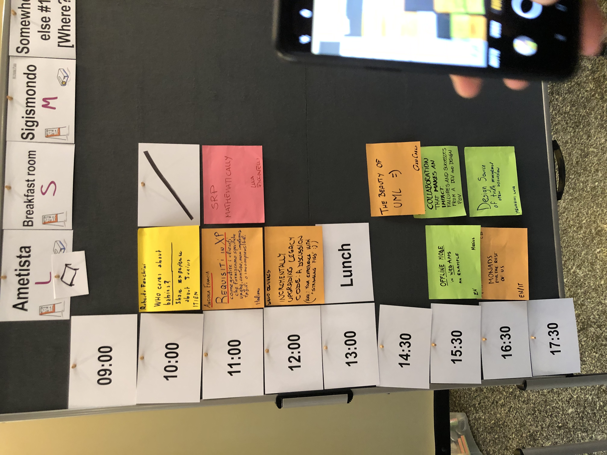
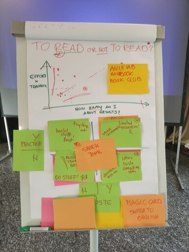

Hi! 👋 Welcome to a new post.

On October 19-21, I attended the SoCraTes (un)conference in Rimini. With over 90 people, we gathered to talk about software crafting, testing, and all related (and unrelated) stuff 😛.

The event was fantastic! I met a lot of new people, gained insights into my current and future learning, and had some interesting (and crazy) discussions (such as discovering the niche of custom keyboards and firmware 🤩)!!!

In this post, I'm going to give a brief summary of what an unconference is and the sessions I attended during the event.

<!--more-->

Enjoy!

## What is an Open Space?

SoCraTes is a unique event because of its interesting format, called Open Space (or Unconference).

In a standard conference, everything is decided up-front: there is a call-for-papers, speakers and the agenda are decided beforehand, there are frontal sessions and workshops, etc. Basically, the attendees just need to come and watch what's offered by the conference organizing committee.

On the contrary, in an Open Space, the format, agenda, and topics discussed are decided by the participants during the event itself. This choice comes from the observation that, during a conference, the most inspiring and interesting stuff happens during coffee breaks and in the common areas. So why don't we transform the entire event into a big coffee break?

On every day of the Open Space, the participants gather to propose and decide the daily agenda: everyone can propose a talk, workshop, discussion, or any other type of activity (even a walking discussion on the beach 😎 or a party game). After the proposals, it's time for the **marketplace**: everyone can ask the session organizer to move the session (to a different time and location) or to change/expand the topic. The important thing is that only the one who proposed the session can change it!

After the marketplace has ended and the agenda is ready, the unconference can start. During the event, there is only one rule to follow, called the "rule of two feet":

> If you are not contributing or adding value to the session, you can move elsewhere freely.
> 

This rule is not confined to the pre-defined sessions. Participants can move between sessions, stay in common areas, or look for other people to start impromptu activities! That's the beauty of the open space format.

Given that they can freely move during the event, participants usually divide into two categories:

- Butterflies: they like to move a lot and cross-pollinate the discussions.
- Bumblebees: they stay in the same room for the entire duration of the session, bringing stability and continuity to the discussions.

Also, the rule of two feet generates four principles:

- Whoever comes is the right people.
- Whenever it starts is the right time.
- Whatever happens is the only thing that could happen.
- When it's over, it's over.

The rule of two feet and the four principles above allow the participants to express themselves in many ways and encourage collaboration and open discussions throughout the event. That's what brought me to attend it!

## My experience at SoCraTes-IT 2023

Here's a brief summary of my experience at SoCraTes 2023. I didn't take many notes and pictures, so most of the descriptions below might be incomplete or plain wrong. This is more of a journaling exercise for me.

Given this disclaimer, if you find any errors, don't hesitate to contact me (or open an issue/PR on my website [repository](https://github.com/marcobacis/marcobacis.github.io) on GitHub 😛).

Enjoy!

### Thursday

The first day was just for networking and getting to know the other participants. I arrived at the hotel in the afternoon, and then we had a happy hour, dinner, and a brief "ice-breaker" game.

We divided into groups, and each group had to introduce itself with a given description. My group had to decide if "casual Friday" was still a thing in the 2020s. We named our group "Eat My Shorts" and gave a short presentation on it. However, there was no interaction or any "theatrical" performance, and only one of us spoke, while other groups put on a show and moved around a lot. A reminder for next time: have more interaction between group members (try to talk 😅) and make the presentation funnier!!

After the ice breaker, I went to my room early because I hadn't been feeling well since the morning and needed to recharge for the next days.

### Friday

Friday was the first day of the Unconference!

We met in the hotel hall to have the first “marketplace”. Everyone interested/inspired attached a post-it with his/her session proposal. Then, we decided the rooms and time for each session.

| | |
| ----------- | ----------- |
|  |  |

Here’s a brief description on the sessions I was able to participate (even for a few minutes):

**Game AI and Montecarlo Tree Search - [Matteo Vaccari](https://www.linkedin.com/in/matteovaccari/)**

In this session, Matteo taught us what a Monte Carlo search is and how it is useful for searching in very large decision trees. A perfect example of this was the game "Commands&Colors" with some parts of the game having a million branch factor!

This was a preliminary test for his talk, which he gave a few days later at Codemotion. I wasn't able to see his entire session at SoCraTes, but I watched his talk at Codemotion and it was great!

For more information (and slides/code), visit [Matteo's website](https://matteo.vaccari.name/).

**The Programmer’s Brain - [Marco Testa](https://www.linkedin.com/in/mrctst/)**

In this session, Marco presented what he learned reading the book “[The Programmer’s Brain](https://www.manning.com/books/the-programmers-brain)” by Felienne Hermans. 

The main concept we discussed was **cognitive load** and ways in which it affects software developers. The book provides many concepts and ways to reduce this cognitive load and make the code we develop easier to understand and remember. Many of the techniques have already been discussed in other books (e.g. clean code), but here they were related to cognitive load and all of its aspects.

The session was really interesting. Having attended a course on memory techniques some years ago I already knew some of the concepts presented, although not applied to software development.

**Stop fighting useless battles: automate code style, architecture compliance and refactoring - [Roberto Franchini](https://www.linkedin.com/in/robfrank/)**

Roberto gave this talk at the [Working Software Conference](https://www.agilemovement.it/workingsoftware/) in June. I didn't see it at that time, but fortunately, he gave it again at SoCraTes! His talk was about ways to automate boring tasks that are quite important to keep a codebase clean among team members.

In particular, he presented:

- [pre-commit](https://pre-commit.com/): a tool to boost commit hooks and CI pipelines, with various tasks and plugins from the community. He uses it to check certain rules, such as passwords and keys, fixing line endings, and more.
- [ArchUnit](https://www.archunit.org/): a tool to unit-test your architecture. It can be used to enforce separation between modules, check that the code doesn't import certain packages, and generally standardize and test the code architecture.
- [OpenRewrite](https://docs.openrewrite.org/): allows for large-scale code refactoring, such as framework/API migrations, code cleanup, and other community-driven code transformations.

I didn't know about any of these tools, so it was a very inspiring talk!

**Discussion on Trunk-Based Development - [Fabio Fortini](https://www.linkedin.com/in/fabio-fortini/)**

After lunch, while everyone was feeling sleepy, Fabio ignited our fighting spirit by presenting a controversial argument: should we use trunk-based development in our projects?

He showed us a presentation he had given to his team in 2021 to convince them of the pros (without having used it before), and then gave his opinion after having done it for a few months.

The discussion was filled with arguments from both parties, and essentially Fabio stopped talking and (unintentionally) handed the stage over to the group.

It was an interesting discussion nonetheless: in the end, trunk-based development can be used as a teaching tool to help the team learn to work with small releases and continuously integrate into the main branch. Afterward, or if the team is already mature enough, small, frequently integrated branches can also be used (and are actually compatible with the trunk-based definition!).

**The Training Crafter - To read or not to read? - [Chiara Barbagianni](https://www.linkedin.com/in/chiarabarbagianni/)**

The topic of the session was learning. Should we learn by reading or by doing, and can the two worlds work together?

Chiara gave a free-flowing presentation to our small group, starting with a survey and then writing on a whiteboard (and a lot of post-it notes) to decide how to merge the two opposing views.

She divided the board into 4 quadrants along 2 axes:

- Practice (doing something practical, or reading about it?)
- Taste (developing a taste for what you are learning, or doing it just for the money?)

At the end, Chiara presented how she's doing it in the [Agile Lab Book Club](https://handbook.agilelab.it/BookClub.html): instead of mandating all members to read a given chapter every time, the format is more generic. Every two weeks, the club curators propose a topic: members can explore it in any way (the recommended book, videos, blogs, anything) and post their learnings on a shared board. At the end of the two-week period, they share what they learned in a short training session.

I loved this session! The way it was kept was fantastic, and we were immersed in Chiara's mind throughout the entire duration of the discussion. That's exactly what I expected from an unconference.

**Monads for the Rest of us (in C#)  - [Arialdo Martini](https://www.linkedin.com/in/arialdomartini/)** 

Even after studying it at the university, I still find it difficult to understand most functional programming concepts. But thanks to Arialdo, now I can understand it a bit more.

In his session, he started to implement monads (the most difficult concept in FP to me) in plain C#. Starting from function composition, passing through functors and implementing the IO monad, he tried to explain to the folks that we are how functional programming concepts map to an object oriented language.

His session was based on a series of posts [on his website](https://arialdomartini.github.io/monads-for-the-rest-of-us), that I will definitely try to follow to learn all there is about monads!

**Friday evening special: Oggetti a Teatro” (Objects on Stage) - [Marco Testa](https://www.linkedin.com/in/mrctst/)**

Unlike many conferences, the party didn’t finish after dinner. Instead, there were 2 parallel sessions. One was a NIX installation party at the pub, while the other was a high-class evening at the theatre.

Marco wrote and gave life to a set of characters (I still remember the *Duke of Client*, the *Count of Receiver*, and *Invoker the spy*!) that together and with their actions formed the perfect description of the Command Pattern. He basically wrote the script of a design pattern, highlighting the behaviour of the different component and their scope. Also, the story was pretty engaging!

Even if short, the *opera* was well received by the public, and I think it would be a great way to explain design patterns in a memorable way.

### Saturday

Second day of Unconference. We started immediately with the session proposals and marketplace, as there was less time than Friday (the event finished at 17).

| | |
| ----------- | ----------- |
|  |  |

**~~Coping~~/Coding with Product - [Alberto Brandolini](https://www.linkedin.com/in/brando/)**

In this session, Alberto continued the discussion started on friday (which unfortunately I didn’t attend…) on how developers can work together with the product/business side without headaches or creating “dirty” code.

He started by re-defining technical debt (which he deemed a wrong analogy) with its opposite, **Design Integrity**: “how much the current codebase fits its purpose” or how much the code is ready for the next change.

He went on explaining how product side is based on “experiments”, as the roadmap is not as clearly defined as we developers would like the code to be. How can we make the two ends meet? Our work as technical people is to work on “safe bets” from a good design to another good design, without reducing the design integrity.

The group went on a discussion on changes of which I didn’t take note, so writing it here would be useless. 

In the end, the core idea is that developers should work together with product to define different “purposes” (either core or not to the business) and isolate these choices in distinct bounded contexts and components, to reduce the possible damage given by continuous product experiments.

This is not a set process, but can evolve based on the product (e.g. a context might get split in multiple services, or multiple services merged because they follow the same purpose…).

Fortunately for us, Alberto wrote a [post](https://medium.com/@ziobrando/from-technical-debt-to-design-integrity-48e7056b6776) in which he explains these concepts in a much cleaner way than me 😅

**Refactoring with CQRS (without events) - [Luca Giovenzana](https://www.linkedin.com/in/lucagiovenzana/)**

Luca showed how they refactored the backend for their startup ([golee](https://golee.it/)) using CQRS, but without using event sourcing as everyone doing CQRS is doing right now. Basically, the team at golee migrated some functionality to the new, greenfield codebase which was used as *write model*, while keeping the old (legacy) code as *read model* and as a backup, by writing to it using a hook.

By keeping the system simple (no events and event sourcing) they were able to keep both systems running, without impacting on their ability to extend it and improving performances.

His session was a nice look at how to take tradeoffs, which are essential when running a startup!

**Create a Macropad for fun!! - [Gianni Bombelli](https://www.linkedin.com/in/gianni-bombelli/)**

During the breaks and dinners on thursday and friday I was introduced to the world of custom keyboards. It’s a world full of crazy people talking about layouts, layers and keys. When Gianni put a post-it named “Create a macropad for FUN!” I couldn’t resist.

In his session, he showed us his “hobby” project, a custom mechanical macropad to help him during training sessions, in which he uses a graphics tablet and might need some ready-to-use shortcuts (e.g. to delete the latest line drawn, to open an application, to use git).

His session was a deep-dive in how to build a custom keyboard, from the PCB up to the customisation with QMK and a bit of C programming. Now I really want a custom macropad!! I’ll wait for the “BomboPad” to enter the market 😛

**Orthogonality of TDD, SOLID, FP - [Matteo Baglini](https://www.linkedin.com/in/matteobaglini/)**

In his session, Matteo showed us how TDD, SOLID principles and Functional Programming are related. He implemented the password validator kata, doing small steps by following TDD and doing it in a functional way.

I came into the session while it was already started so I lost most of the context. Fortunately, Matteo shared the [repo](https://github.com/matteobaglini/orthogonality-socrates-it-2023) containing the kata implementation, with every small step of the red-green-refactor process explained in separate commits! A great way to visualize TDD in action.

**PKMS/Note Taking - [Jaga Santagostino](https://www.linkedin.com/in/jagasantagostino/)**

The final session I attended was an open discussion about Obsidian and Personal Knowledge Management Systems (PKMS) in general.

Jaga showed us the many features in Obsidian and tried to compare it with another famous PKMS application, Notion.

While presenting, other participants asked questions and gave their opinions. For example I learned about another tool, called logseq, which is quite similar to obsidian.

In the end I gave obsidian a try. I actually used it to take notes during the unconference, and to take notes at the Codemotion conference the week later. I now found out how to share my notes with git, so from now on I’ll try to use it instead of Notion! It’s local-first paradigm is very useful when working offline, and the backlinks and graph view are really interesting and allow to link ideas together. Also, is definitely faster than notion 😅.

Thanks Jaga for this discovery!

## The End!

SoCraTes was a great event! I met new people, learned a lot and had fun, the perfect combination    for a conference.

I came home with a lot of new concepts, tools and inspiration, and I cannot wait for the next event like this (which will be the [2023 Agile Day](https://www.agileday.it/) Unconference, on Nov. 17 😛).

As always, thanks for all the participants, to the sponsors, organizer and everyone involved. The most meaningful connections happen in a free and creative environment, and that’s exactly what SoCraTes is.

Thanks for reading this long and boring summary, I hope to have shown (even a bit) all I saw and felt during the event. If you find anything to correct (e.g. about your session, about my grammar, or if I forgot something) just contact me via mail or linkedin, or open an issue on this website repository on github.

As always, see you next time!